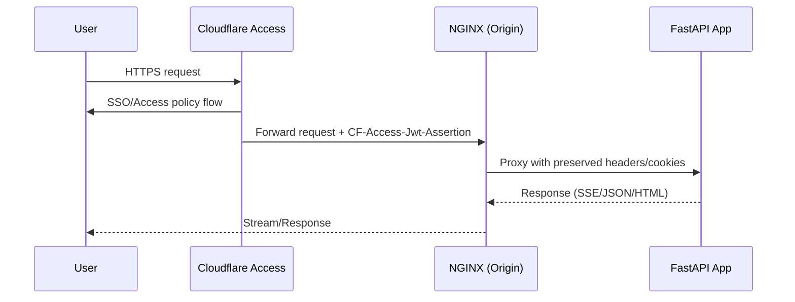
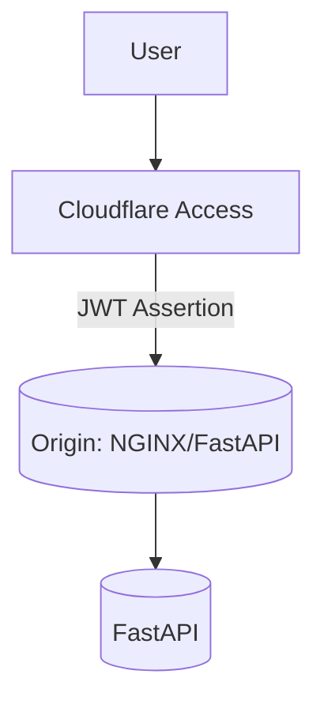

# Authentication Architecture Options: NGINX Reverse Proxy vs Cloudflare Access (Zero Trust)

> Goal: Establish a robust, scalable, and developer‑friendly authentication layer in front of the Second Brain app, with explicit consideration for SSE, API routes, static assets, and future React frontend.

## Executive Summary

- NGINX reverse proxy with OAuth2/OIDC (via `oauth2-proxy` or `auth_request`) is logical and gives full control on‑prem and in self‑hosted setups. It fits well with our FastAPI app and SSE usage.
- Cloudflare Access (Zero Trust) offers managed, globally distributed auth and perimeter controls with minimal origin changes, plus WAF/CDN/DoS protections, but adds vendor coupling.
- Best of both: Put Cloudflare in front for global auth and security; keep NGINX at origin for fine‑grained route control (SSE, rate limiting, header normalization, internal service auth).

Key considerations for our app:
- SSE endpoints must be explicitly tuned at the proxy (disable buffering, extend timeouts, preserve cookies/headers).
- We have both browser and programmatic clients; OAuth flows and token propagation must be clear.
- For React dev (Vite @ `http://localhost:5173`), CORS and cookie policies must be aligned.

---

## High‑Level Options

### Option A: NGINX Reverse Proxy + OAuth2/OIDC (Self‑Managed)

- Reverse proxy terminates TLS, enforces auth via:
  - `auth_request` to an internal `/internal/auth` endpoint, or
  - Sidecar `oauth2-proxy` (common & robust) with providers: Google, GitHub, Okta, generic OIDC.
- After auth, NGINX passes `X-User-*` headers to FastAPI. FastAPI can trust those headers if signed or if NGINX is the only entry point.

```mermaid
flowchart LR
  U[User Browser] -->|HTTPS| N(NGINX)
  N -->|Auth redirect / cookie| IdP[(OIDC Provider)]
  N -->|Forward auth ok + headers| A[FastAPI App]
  N -->|/static| Static[Static Files]
  N -->|SSE tuned| SSE[/api/status/stream/{id}]
```

Pros
- Full control; great for self‑hosted and air‑gapped envs.
- Works the same locally and in prod.
- `oauth2-proxy` battle‑tested; supports multi‑provider and groups/claims.

Cons
- More ops overhead (certs, renewal, scaling, logs).
- You own rate limiting, WAF, bot mitigation.

---

### Option B: Cloudflare Access (Zero Trust) in Front of the App

- Cloudflare enforces identity at the edge (SSO, device posture, groups). Origin only receives requests with valid `CF-Access-Jwt-Assertion` header.
- Can pair with Cloudflare Tunnel (cloudflared) to avoid exposing public ports.
- Origin (or an NGINX layer) can validate Access JWT using Cloudflare public keys.

```mermaid
flowchart LR
  U[User Browser] -->|HTTPS| CF[Cloudflare Access]
  CF -->|JWT header + WAF + CDN| N(NGINX Origin)
  N --> A[FastAPI App]
  CF -.->|Static CDN| Static
  N -->|SSE tuned| SSE[/api/status/stream/{id}]
```

Pros
- Managed auth, MFA, device posture, geo controls; global POPs.
- WAF, CDN, DDoS, caching included.
- Faster time to secure external access without app changes.

Cons
- Vendor lock‑in and policy coupling.
- Local dev parity requires mocking or bypass.
- JWT validation planning required at origin/app if you use origin‑aware authorization.

---

### Option C: Hybrid (Recommended)

- Cloudflare Access at the edge for user SSO, WAF, and global access control.
- NGINX at origin for:
  - SSE/WebSocket tuning and connection stability
  - Fine‑grained routing rules and rate limiting
  - Internal service authentication (mTLS, service tokens)
  - Header normalization and security headers



---

## NGINX Reverse Proxy Details (Option A / Origin in Hybrid)

Core blocks to enable:

1) Proxy basics and header normalization

```nginx
server {
  listen 443 ssl http2;
  server_name example.com;

  # TLS config omitted for brevity

  # Forwarded headers
  proxy_set_header Host $host;
  proxy_set_header X-Real-IP $remote_addr;
  proxy_set_header X-Forwarded-For $proxy_add_x_forwarded_for;
  proxy_set_header X-Forwarded-Proto $scheme;

  # Increase header size for larger cookies/JWTs
  large_client_header_buffers 8 32k;

  location /static/ {
    alias /app/static/;
    add_header Cache-Control "public, max-age=31536000, immutable";
  }

  location / {
    proxy_pass http://app:8080;
    proxy_read_timeout 120s;
  }
}
```

2) SSE endpoint tuning (critical for our `/api/status/stream/{note_id}`)

```nginx
location ^~ /api/status/stream/ {
  proxy_pass http://app:8080;
  # SSE stability
  proxy_buffering off;
  proxy_cache off;
  proxy_read_timeout 1h;
  chunked_transfer_encoding off;
  # Required for EventSource over proxies
  add_header X-Accel-Buffering no;
}
```

3) OAuth2 with `oauth2-proxy` (forward auth)

```nginx
# Protect everything under /
auth_request /oauth2/auth;
error_page 401 = @oauth2_signin;

location = /oauth2/auth {
  internal;
  proxy_pass       http://oauth2-proxy:4180/oauth2/auth;
  proxy_set_header X-Original-URI $request_uri;
  proxy_set_header X-Real-IP $remote_addr;
  proxy_set_header X-Forwarded-For $proxy_add_x_forwarded_for;
  proxy_set_header X-Forwarded-Proto $scheme;
}

location @oauth2_signin {
  return 302 /oauth2/start?rd=$request_uri;
}

location /oauth2/ {
  proxy_pass http://oauth2-proxy:4180;
}

# Bypass auth for health and webhooks if needed
location = /health { proxy_pass http://app:8080; auth_request off; }
# Example webhook bypass
# location /api/webhook/discord { proxy_pass http://app:8080; auth_request off; }
```

4) Security headers (complement app‑level headers)

```nginx
add_header X-Frame-Options SAMEORIGIN always;
add_header X-Content-Type-Options nosniff always;
add_header Referrer-Policy no-referrer-when-downgrade always;
add_header Strict-Transport-Security "max-age=31536000; includeSubDomains; preload" always;
# Apply CSP once inline scripts/styles are externalized
# add_header Content-Security-Policy "default-src 'self'; script-src 'self'; style-src 'self' https://fonts.googleapis.com; font-src 'self' https://fonts.gstatic.com" always;
```

Notes for our app:
- CSRF: Keep same‑site cookies (`SameSite=Lax` or `Strict`) and send `X-CSRF-Token` on mutating requests. Reverse proxy does not replace CSRF.
- CORS for React dev server: allow `http://localhost:5173` only in dev (not prod).
- Static: NGINX should cache aggressively; app’s `/static` is immutable if fingerprinted.
- Attachments/downloads: Consider signed URLs or protected location blocks if we gate downloads by auth.

---

## Cloudflare Access (Zero Trust) Details (Option B / Edge in Hybrid)

How it works
- Users authenticate to Cloudflare Access via configured IdPs; successful requests include `CF-Access-Jwt-Assertion` header.
- Origin can validate this JWT using Cloudflare’s public keys (JWKS). Alternatively, trust Access and restrict origin exposure (Cloudflare Tunnel).
- Access policies can be path‑based and scoped (e.g., open `/health`, protect `/api/`).



Validation options at origin:
- Validate JWT in NGINX with `lua-resty-openidc` (OpenResty) or in app (FastAPI middleware).
- Or trust Access and keep origin private via Cloudflare Tunnel; do not accept direct internet traffic.

SSE considerations with Cloudflare
- EventSource works through Cloudflare, but ensure:
  - No aggressive buffering at edge (Cloudflare handles streaming; origin must disable buffering as above).
  - Long‑lived connections allowed (plan limits/timeouts apply). If issues, place SSE under a page rule to bypass cache and enable “no route cache”.

Pros/Cons recap
- Pros: Managed auth, WAF, CDN, global speed; great for internet‑facing prod.
- Cons: Dev parity requires mocks; additional complexity verifying Access JWT at origin if you do origin‑aware auth.

---

## Integration Points for Second Brain

Routes and behaviors to plan for:
- SSE: `/api/status/stream/{note_id}` → must be unbuffered with long `proxy_read_timeout`. Ensure cookies or token query param pass through intact.
- Token refresh: `/api/sse-token` → must be allowed behind auth; supports cross‑origin dev if needed.
- Search/Notes APIs: `/api/search/*`, `/api/notes/*` → protected behind Access or oauth2‑proxy; preserve `Authorization`/cookies.
- Static: `/static/*` → can be public with CDN caching; no auth required unless sensitive.
- Health: `/health` → consider allow‑list by IP (monitoring) or keep public but read‑only.
- Webhooks/integrations (Discord, Apple Shortcuts, mobile capture):
  - If any webhooks need to POST unauthenticated, add explicit bypasses and separate secrets/signatures.

Headers to preserve to the app
- `Host`, `X-Real-IP`, `X-Forwarded-For`, `X-Forwarded-Proto` for correct URL building and logging.
- If using Access JWT at app: `CF-Access-Jwt-Assertion`.

Cookie and session settings
- `Secure; HttpOnly; SameSite=Lax` for user session cookies.
- Domain/scope consistent between React app host and API host.

CORS (for React dev)
- Allow `http://localhost:5173` (dev only), methods `GET,POST,PUT,DELETE,OPTIONS`, headers `Content-Type, Authorization, X-CSRF-Token`, credentials true.

---

## Recommendation

- For production internet exposure: adopt the Hybrid model
  - Cloudflare Access in front for SSO, WAF, global availability.
  - NGINX at origin to fine‑tune SSE, apply rate limits, origin‑side headers, and to support internal paths (webhooks) that may need different auth.
- For self‑hosted/offline deployments: offer an NGINX‑only blueprint (Option A) using `oauth2-proxy` or native `auth_request` to an OIDC identity provider.

This balances security, performance, and developer experience while minimizing app code changes.

---

## Phased Implementation Plan

1) Foundation
- Stand up NGINX in front of FastAPI in staging.
- Add SSE tuning and header normalization.
- Externalize inline scripts/styles to make CSP feasible (app change, low risk).

2) Auth Enablement
- Option A: Deploy `oauth2-proxy` and protect all routes; bypass `/health` and specific webhooks.
- Option B: Enable Cloudflare Access; restrict origin exposure with Cloudflare Tunnel.

3) Hardening
- Add security headers at NGINX and/or app.
- Add rate limiting: `limit_req_zone $binary_remote_addr zone=api:10m rate=5r/s;` and apply on `location /api/`.
- Lock down uploads/downloads if needed with signed URLs or internal redirects.

4) Dev Parity
- For React dev server: NGINX CORS in staging; mock Cloudflare Access tokens if needed.
- Document local loop: direct to app without Access, using `oauth2-proxy` locally if desired.

5) Monitoring & Logs
- Centralize logs (NGINX access/error, oauth2‑proxy, app).
- Add request IDs and propagate (e.g., `X-Request-ID`).

---

## Quick Reference Config Snippets

NGINX rate limiting (API only)
```nginx
limit_req_zone $binary_remote_addr zone=api:10m rate=5r/s;

server {
  # ...
  location /api/ {
    limit_req zone=api burst=20 nodelay;
    proxy_pass http://app:8080;
  }
}
```

Validating Cloudflare Access JWT in FastAPI (sketch)
```python
from fastapi import Request, HTTPException
from jose import jwt
import requests

CF_JWKS = requests.get("https://YOURDOMAIN.cloudflareaccess.com/cdn-cgi/access/certs").json()

def verify_cf_access(request: Request):
    token = request.headers.get("Cf-Access-Jwt-Assertion")
    if not token:
        raise HTTPException(status_code=401, detail="Missing CF Access token")
    # Pick matching key and validate claims (aud, iss, exp)
    # Use jose jwk construct + jwt.decode(key=public_key)
```

Cloudflare Access setup (high level)
- Create an Access Application for your domain/path.
- Configure IdP (Google, GitHub, OIDC provider) and policies.
- (Optional) Use Cloudflare Tunnel (cloudflared) to connect origin to Cloudflare.
- Test JWT presence and claims at origin.

---

## Risk & Edge Cases

- Long‑lived connections: SSE can be terminated by overly aggressive proxies. Ensure timeouts and buffering are set (both edge and origin).
- Webhooks/external systems: If you move to Access‑only, ensure inbound webhooks/devices can still reach allowed paths (service tokens or bypass rules).
- CSRF and cookie modes: Keep app’s CSRF in place; reverse proxy auth does not protect against CSRF on state‑changing routes.
- Mixed origins during React migration: If UI and API are on different hosts, finalize CORS + cookie domain strategy early.

---

## Final Take

Designing an NGINX reverse proxy for auth is logical and aligns well with our current stack and needs (especially SSE). Cloudflare Access adds strong security at the edge with little friction. The hybrid approach provides the best balance: managed edge security and local control at origin, with minimal or no app code changes.

